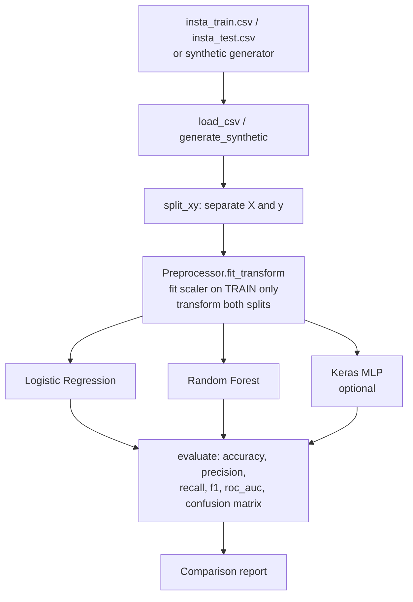

# fakedetect — Instagram Fake-Account Detection

A reproducible ML pipeline that classifies Instagram accounts as fake or genuine
from tabular profile features.

> **Note:** This is one of my first ML projects, refactored into a reproducible
> pipeline. The original was a Jupyter notebook written while learning
> TensorFlow/Keras. It has been restructured into a proper Python package with
> clean separation of concerns, fixed bugs, and a test suite that runs offline
> without TensorFlow.

---

## Honest architecture note

The original notebook was occasionally labelled "LSTM" in passing, but the
architecture is **entirely feed-forward Dense layers** — there is nothing
recurrent about it. LSTMs are designed for sequential data (time series, text);
this dataset consists of independent tabular profile features. The correct term
is **Multi-Layer Perceptron (MLP)**.

## Data-leakage bug fixed

The original notebook contained a subtle data-leakage bug:

```python
# ORIGINAL (buggy) — refits the scaler on test data
X_test = scaler.fit_transform(X_test)  # ← wrong!

# FIXED — uses scaler already fitted on training data
X_test = scaler.transform(X_test)      # ← correct
```

Re-fitting the scaler on test data leaks test-set statistics into preprocessing,
giving optimistically biased evaluation scores. This is fixed in
`src/fakedetect/features.py` and covered by a regression test.

---

## Dataset

The classic **"Instagram fake spammer genuine accounts"** dataset.

- Source: [Kaggle — free4ever1](https://www.kaggle.com/datasets/free4ever1/instagram-fake-spammer-genuine-accounts)
- Files: `insta_train.csv`, `insta_test.csv`
- Place them in the `data/` directory.

### Features (11 inputs)

| Column | Type | Description |
|---|---|---|
| `profile pic` | 0/1 | Has a profile picture |
| `nums/length username` | float | Digit ratio in username |
| `fullname words` | int | Word count in full name |
| `nums/length fullname` | float | Digit ratio in full name |
| `name==username` | 0/1 | Full name equals username |
| `description length` | int | Bio character count |
| `external URL` | 0/1 | Has an external URL |
| `private` | 0/1 | Account is private |
| `#posts` | int | Number of posts |
| `#followers` | int | Follower count |
| `#follows` | int | Following count |

**Target:** `fake` (0 = genuine, 1 = fake)

---

## Model lineup

| Model | Notes |
|---|---|
| Logistic Regression | Fast, interpretable baseline |
| Random Forest | Strong ensemble baseline; feature importances |
| Keras MLP (optional) | Refactored original architecture; requires TensorFlow |

---

## Quickstart

No real data or TensorFlow needed:

```bash
git clone https://github.com/yourusername/smfad
cd smfad

pip install numpy pandas scikit-learn
python -m fakedetect.cli train --synthetic
```

With real data:

```bash
# Place insta_train.csv and insta_test.csv in data/
python -m fakedetect.cli train
```

With the optional Keras MLP:

```bash
pip install 'fakedetect[nn]'
python -m fakedetect.cli train --synthetic --nn
```

Run tests (no TensorFlow required):

```bash
pip install pytest ruff
python -m ruff check src tests
python -m pytest
```

---

## Results on synthetic data

> **Caveat:** These numbers are on a synthetically generated dataset designed
> to be learnable (it encodes the general pattern that fake accounts tend to
> have no profile picture, higher digit ratios in usernames, fewer followers,
> etc.). They are **illustrative only** and not comparable to results on the
> real Kaggle dataset.

Typical results (`python -m fakedetect.cli train --synthetic`):

| Model | Accuracy | F1 | ROC-AUC |
|---|---|---|---|
| Logistic Regression | ~0.82 | ~0.82 | ~0.90 |
| Random Forest | ~0.90 | ~0.90 | ~0.97 |

On the real dataset the numbers will differ; please benchmark with
`python -m fakedetect.cli train` after downloading the CSVs.

---

## Pipeline diagram



---

## What I improved / next steps

### Improvements over the original notebook

- **Bug fix:** Data-leakage in StandardScaler (fit on train only, transform test).
- **Architecture honesty:** Correctly named the model a feed-forward MLP, not LSTM.
- **Early stopping:** The Keras MLP now uses `EarlyStopping(patience=15)` instead
  of running a fixed 500 epochs, preventing overfitting.
- **Reproducible package:** Proper `src/` layout, `pyproject.toml`, installable
  via pip.
- **Offline-first:** All core logic (baselines + evaluation) works without
  TensorFlow or any network access.
- **Test suite:** Schema tests, leakage regression test, metric range checks.

### Possible next steps

- Hyperparameter tuning with `sklearn.model_selection.GridSearchCV`.
- SHAP values for model explainability.
- Cross-validation instead of a single train/test split.
- A lightweight web demo (Streamlit or Gradio).
- Export the fitted model to ONNX for portable inference.

---

## License

MIT — see [LICENSE](LICENSE).
